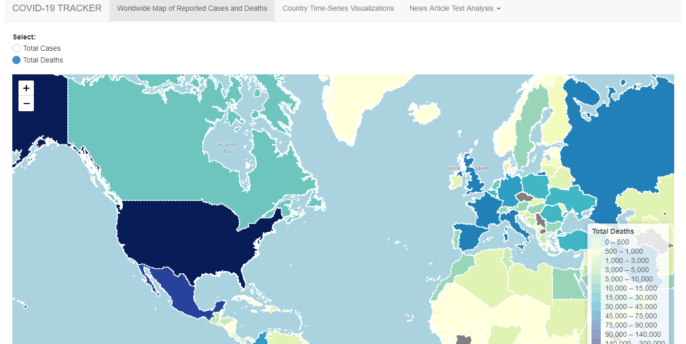
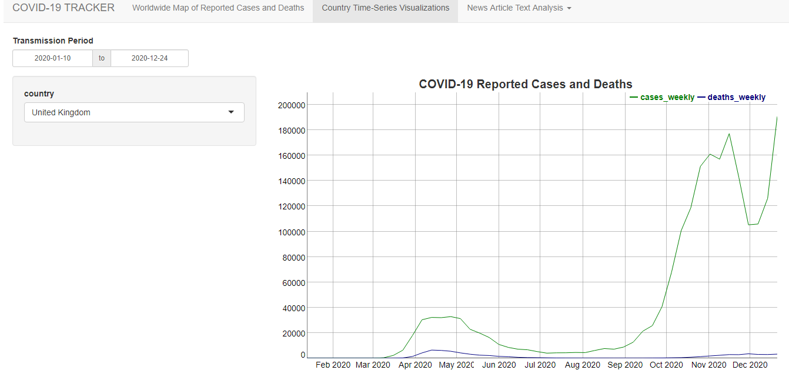
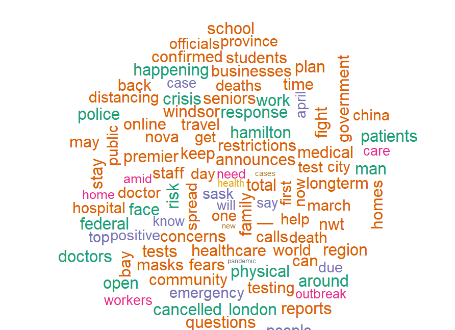

# COVID-19-Tracker

## Running the App

You can launch the app by running:
```
library(shiny)

# Use runGitHub
runGitHub( "<COVID-19-Tracker>", "<lauramurphy12>")

# Run a tar or zip file directly
runUrl("https://github.com/lauramurphy12/COVID-19-Tracker/archive/master.tar.gz")
runUrl("https://github.com/lauramurphy12/COVID-19-Tracker/archive/master.zip")

```
Or you can clone this repository, followed by runApp(). 

```
setwd("~/COVID-19-Tracker")
runApp()
```


## Screenshots





## Acknowledgements

COVID-19 Tracker uses data from the European Centre for Disease Prevention and Control found at [link](https://www.ecdc.europa.eu/en/covid-19/data). Geojson polygons for the world countries come from Natural Earth, Lexman, and the Open Knowledge Foundation as found here: [link](https://datahub.io/core/geo-countries). This application also uses data from CBC News Open Research Dataset with license
CC BY-NC-SA 4.0(Creative Commons Attribution-NonCommercial-ShareAlike 4.0 International). Details about the license can be found at [link](https://creativecommons.org/licenses/by-nc-sa/4.0/legalcode). The dataset was obtained at  [link](https://www.kaggle.com/ryanxjhan/cbc-news-coronavirus-articles-march-26).
